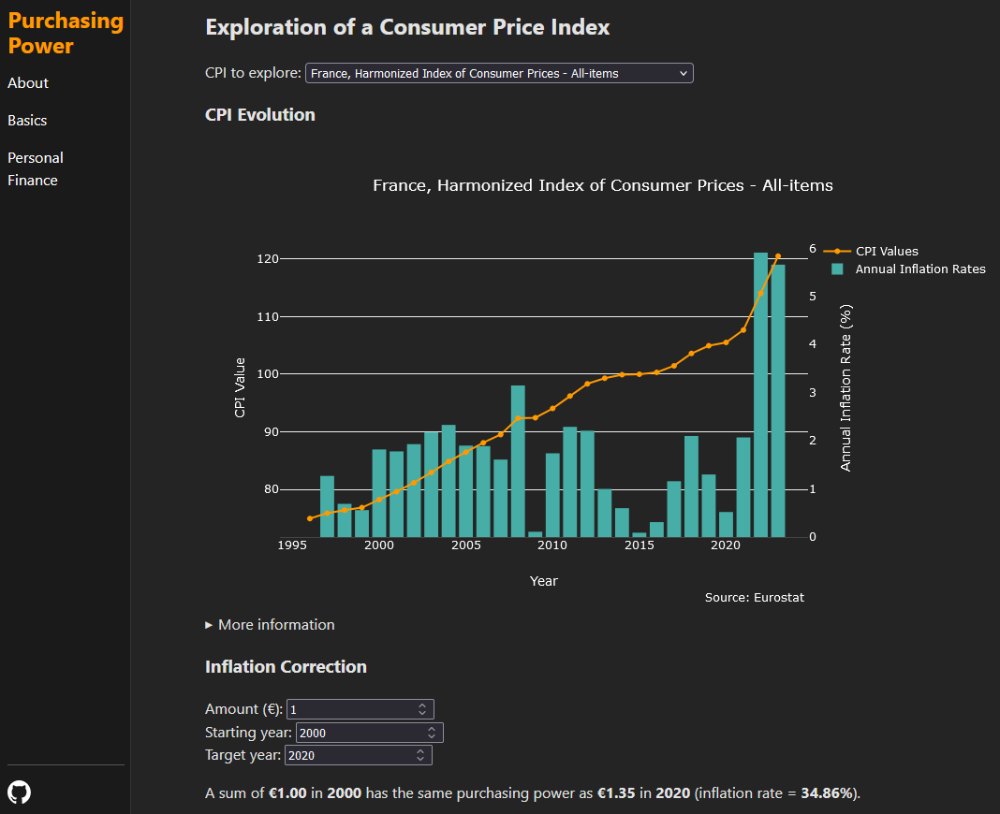

# :chart_with_upwards_trend: Purchasing Power
## The application

Purchasing Power is a web application that provides tools to understand the changing nature of a currency's purchasing power over time and, in the next versions, the impact those evolutions have on simple investment projections. The application contains a database of Consumer Price Indexes (CPIs) gathered from official sources and covers 36 countries (EU and US).

## The stack

The application is composed of four services:
- ETL: fetches the data from [Eurostat](https://ec.europa.eu/eurostat), the [US Bureau of Labor Statistics](https://www.bls.gov/), and [REST Countries](https://restcountries.com/) and loads it into a PostgreSQL database.
    - Python, Docker.
    - Runs punctually on the local machine.
- Enrichment: normalizes the data in the database.
    - PSQL, Python, Docker.
    - Runs punctually on the local machine.
- Backend: uses the database and some (tested) logic to provide data to the frontend.
    - Python (FastAPI), Docker.
    - Runs on an AWS EC2 instance.
- Frontend: displays the data to the user.
    - React, Vite, Docker
    - Runs on an AWS S3 bucket.

This is a monorepo: all services are in the same repository. Also, each service has a README with specific technical instructions.
